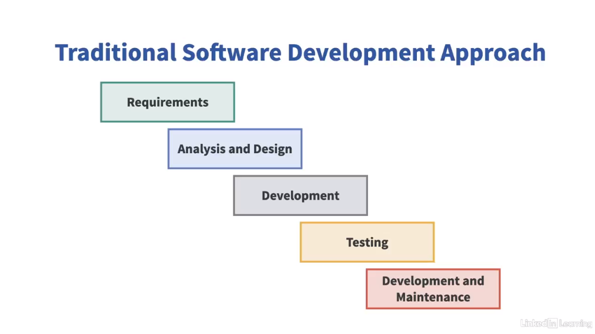
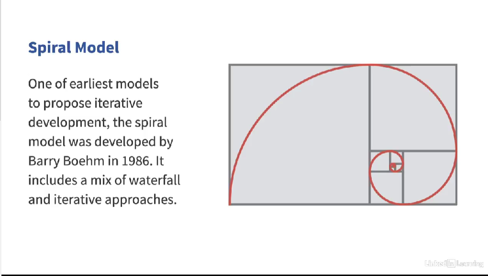
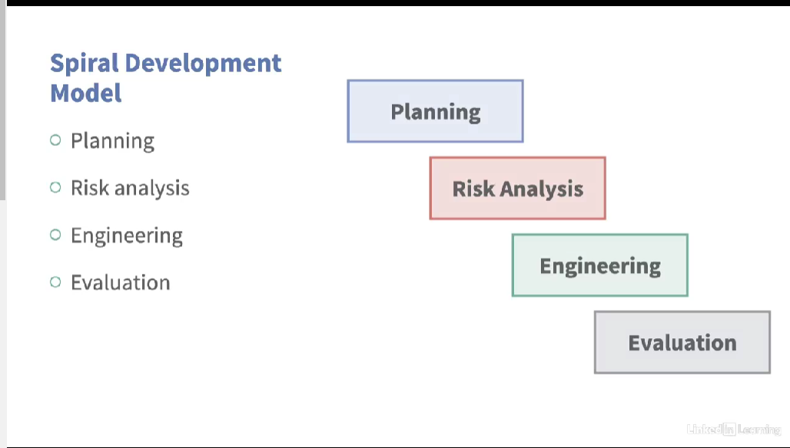
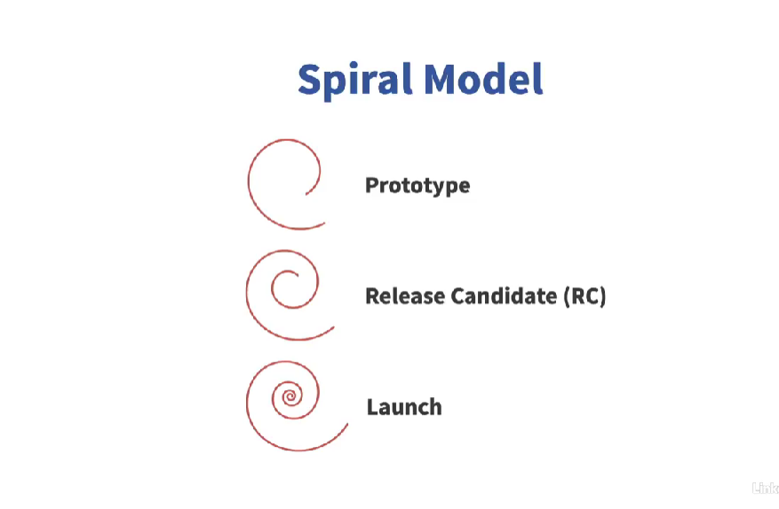
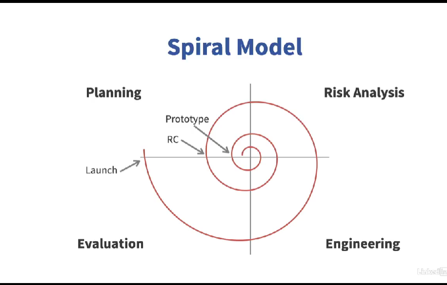

# 💡 Software Development Models: Waterfall & Spiral

Welcome to a deep dive into two foundational software development models: **Waterfall** and **Spiral**. These models shaped the early eras of software engineering and still influence modern processes today.

---

## 🏞️ The Waterfall Model: A Structured Cascade

> _"The waterfall approach appears most intuitive to us at the first sight."_  

Imagine building software the same way you manufacture a car—step by step, phase by phase. That’s the **Waterfall Model**, inspired by the **manufacturing industry** where identical products are built in a consistent, planned manner.

### 📌 Key Characteristics:
- **Sequential Process**:  
  Each phase starts *only* after the previous one completes.  
  ↪ The output of one phase becomes the input for the next.

- **Fixed Scope & Planning**:  
  All planning is done **upfront** with **detailed documentation**.

- **Well-Defined Phases**:
  1. **Requirements Analysis** – Capture and document all requirements.
  2. **Analysis & Design** – Create high-level design and testing specs.
  3. **Development** – Build the actual software system.
  4. **Testing** – Verify system behavior matches expectations.
  5. **Deployment & Maintenance** – Rollout the system and maintain it.

  

---

### ⚠️ The Domino Effect of Errors

One major issue: ❌ **Error Propagation**

> _"If you introduce an error in one phase, that error will propagate..."_

Example:
- Incomplete requirements → flawed design → broken implementation  
This ripple effect can lead to major issues later in the lifecycle.

---

### 🚫 The Pitfalls of Waterfall

- The **customer doesn’t see** the product until the **late testing phase**, often **⅔ of the way** through the timeline.
- By the time feedback is possible, the product may be **irrelevant**, **flawed**, or **misaligned** with current market or business needs.
- In the fast-changing world of software:
  - Requirements evolve.
  - Teams and technologies shift.
  - Stakeholders refine needs midstream.

The Waterfall model **cannot gracefully handle change**—but change is **inevitable** in software.

---

### 🧠 Key Insight:

> _"Software is not a product designed to be built by assembly lines."_  

Software development is **human-centric**—relying on **judgment**, **creativity**, and **collaboration** more than checklists and control systems.

---

## 🧩 When Does Waterfall Still Work?

Despite its flaws, **Waterfall isn’t dead**. It still finds relevance in:

✅ **Simple & Small Systems**  
✅ **Maintenance Projects** (especially when the team has strong domain knowledge)  
✅ **Mission-Critical Systems** – like healthcare or aerospace, where:
- **Gated checks** are essential.
- **Comprehensive documentation** is non-negotiable.
- **Human life** could be at risk from a defect.

---

## 🔁 The Spiral Model: Risk-Driven Iteration

> _"The spiral development model was presented by Barry Boehm in 1986."_  

This model introduced **iterative development** by blending:
- Waterfall’s **structure**
- Agile’s **feedback and adaptation**
- And a heavy focus on **risk management**

---

### 🔄 How It Works:

Each cycle of the spiral consists of **four key phases**:
1. **Planning**
2. **Risk Analysis**
3. **Engineering**
4. **Evaluation**

After each cycle (or "mini-waterfall"), the next builds on top of it—**getting closer to a complete product**.

---

### 📊 Visualizing the Spiral

Imagine a **graph with 4 quadrants**:

🟦 **Top-Left**: Planning  
🟥 **Top-Right**: Risk Management & Prototyping  
🟨 **Bottom-Right**: Engineering  
🟩 **Bottom-Left**: Evaluation & Stakeholder Feedback  

- **X-Axis**: Approval over time  
- **Y-Axis**: Cumulative cost  
- The **spiral shape** reflects growing complexity and cost with each iteration.

   

---

### 🧭 Spiral Phases Explained

#### 1. 🔹 Planning
- Identify requirements
- Determine stakeholders and lifecycle objectives
- Define **"win conditions"** for project success

#### 2. 🔸 Risk Analysis
- Identify, prioritize, and mitigate risks
- Build **prototypes** to reduce uncertainties
- Explore alternative solutions

#### 3. ⚙️ Engineering
- Conduct detailed design
- Perform coding, unit testing, and deployment
- Each iteration increases in functionality—from models to real systems

#### 4. 🧪 Evaluation
- Gather stakeholder **feedback**
- Refine requirements
- Plan the next iteration

---

### 🧱 Building Iteration-by-Iteration

Each loop in the spiral can produce:
- ✅ A **prototype**
- ✅ A **release candidate**
- ✅ A **launch-ready version**

> _"Each iteration builds upon the output of the previous iteration."_  

This stepwise refinement means you're **always improving**, **always learning**, and **reducing risk**.

---

## 🧠 Why Spiral Was Ahead of Its Time

- Long before Agile, Spiral recognized that:
  - Software development is inherently **iterative**
  - **Risk management** is **non-optional**
  - **Prototyping** is a must-have
  - Constant **stakeholder feedback** is the key to success

---

## 💬 Final Thoughts

> ✅ **Waterfall** gives you structure—but struggles with change.  
> 🔄 **Spiral** embraces change—by reducing risks and iterating smartly.

As you move forward in your software career, choose the model that fits **your project’s risk level, complexity, and change tolerance**.

---

> _"Stay focused on risk. Deliver value early. Let feedback guide the way."_  

