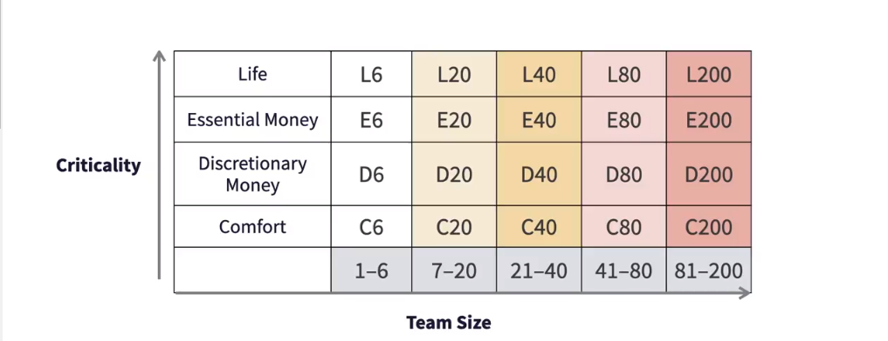

# 🚀 Agile Software Development Approaches: DSDM, FDD, & Crystal Methods

Software development is not one-size-fits-all. Different projects demand different methodologies. In this guide, we’ll explore **three powerful agile approaches** that evolved to meet the growing need for speed, flexibility, and quality in software delivery:

- 🌐 Dynamic Systems Development Method (DSDM)
- ⚙️ Feature-Driven Development (FDD)
- 🧬 Crystal Methods

Let’s deep dive into each, uncovering their origins, processes, and best-fit scenarios.

---

## 🌐 Dynamic Systems Development Method (DSDM)

> "Structure meets agility."  
> — Born out of the RAD era, matured with process discipline.

### 📜 Origins

- **Introduced**: 1994  
- **Backdrop**: Organizations were moving away from rigid Waterfall methods. RAD (Rapid Application Development) was gaining popularity.
- **Challenge**: RAD enabled fast development but lacked structure and formal processes.
- **Solution**: A consortium of organizations came together to create **DSDM**—a framework offering **agility with control**.

> ✅ Designed to align with **ISO 9000** and **PRINCE2** (popular in Europe).

- **In 2016**, DSDM Consortium renamed itself to **Agile Business Consortium**.  
- The **DSDM Handbook** became publicly available in 2014.

---

### 🧠 DSDM Mindset: 8 Key Principles

One key example:
- **Principle 8 – Demonstrate Control**:  
  Keep the plan **visible**, **well-managed**, and **on-track** without veering off-course.

> You can find all 8 principles at [Agile Business Consortium](https://www.agilebusiness.org/).

---

### 🔁 Lifecycle of DSDM

1. **Pre-Project Phase**
   - Managed at executive/portfolio level
   - Projects are identified and funded

2. **Project Lifecycle Phase**
   - **Feasibility Analysis**
   - **Iterative and Incremental Development**
   - Heavy stakeholder involvement

3. **Post-Project Phase**
   - Check if expected benefits were realized
   - Conduct post-mortems for improvement

> 🔄 Not waterfall-like: Phases **can iterate and repeat**.

---

### 🧰 Key Practices in DSDM

- **Timeboxing**:  
  Set a strict time limit for every activity. When time's up, the task stops—keeping teams focused and preventing over-polishing.

- **MoSCoW Prioritization**:
  - **Must Have**
  - **Should Have**
  - **Could Have**
  - **Won’t Have**

- **Iterative and Incremental**:  
  Emphasizes constant feedback and evolving solutions—practices still central to Agile today.

---

## ⚙️ Feature-Driven Development (FDD)

> "Build software feature by feature—with business value at the core."

### 🛠️ Core Philosophy

- FDD views software as a **collection of working features**.
- Each **feature** is:
  - A small, testable functionality
  - Written in the format: **Action + Result + Object**
  - Example: `Calculate monthly interest on account balance`

---

### 🔄 The 5-Step FDD Lifecycle

1. **Develop Overall Model**
   - Create a high-level **domain model**
   - Understand business concepts and relationships

2. **Build Feature List**
   - Break domain into **subject areas**
   - Identify business **activities** and derive **features**

3. **Plan by Feature**
   - Prioritize features
   - Assign features to developers

4. **Design by Feature**
   - Flesh out design using **class diagrams** and **sequence diagrams**
   - Perform thorough **design inspections**

5. **Build by Feature**
   - Code, test, inspect, and deploy each feature

> The last two steps run in **parallel**, executed by **feature owners**.

---

### 📊 Feature Tracking with Milestones

- Each feature progresses through milestones, each with a % completion.
- Example:
  - Milestone 1.1 → 10%
  - Milestone 1.2 → +20%
  - Milestone 2.1 → +30%
  - **Total progress: 60%**

---

### 💡 Why FDD Works

- **Scales easily**: Feature teams can work independently.
- Encourages **UML** and **object-oriented design**
- Originated in banking systems, where **rigor + value** were essential.
- Great for projects needing measurable progress via **business-focused features**.

---

## 🧬 Crystal Methods

> "Right-size your process based on your team and your project’s risk."

### 📚 Background

- Developed by **Alistair Cockburn** in the 1990s
- Not one method, but a **family** of methodologies
- Color-coded and chosen based on:
  - **Team Size** (X-axis)
  - **Criticality** (Y-axis – i.e., risk severity)

  

---

### 📈 The Crystal Chart Explained

#### 🔺 Criticality Levels (Y-Axis)
- 🧊 **Comfort**:  
  Loss is minimal (e.g., a crashing photo filter app)
  
- 💵 **Discretionary Money**:  
  Loss of bonus/extra cash (e.g., a coupon app)

- 💰 **Essential Money**:  
  Business-critical losses (e.g., eCommerce downtime)

- 🛑 **Life**:  
  Potential for human casualty (e.g., aviation software)

#### 📊 Team Size (X-Axis)
- Ranges from 1 to 100+
- Larger teams → need for **more structure & roles**

---

### 🌈 Crystal Method Variants

| Crystal Method | Team Size | Criticality | Roles/Deliverables |
|----------------|-----------|-------------|---------------------|
| 🟢 Crystal Clear | 1–6 | Low (Comfort) | Just 3 roles: Sponsor, Senior Designer, Programmer + 1 deliverable (Working Software) |
| 🟠 Crystal Orange | ~30 | Essential Money | Adds roles: Architect, BA, PM, etc. More documents like UI design, test cases |

> 🚨 For life-critical systems, process customization is needed with **extra quality checks**.

---

### 💬 Core Philosophy of Crystal

> "People over processes."

- **People-centric**, **lightweight**, and **flexible**
- Emphasizes:
  - **Communication**
  - **Team interaction**
  - **Reflection & improvement**
- Uses **frequent delivery**, **automated tests**, and **continuous integration**

---

### 🧩 Why Crystal Stood Out (But Didn’t Dominate)

- First methodology to say:  
  _"No one-size-fits-all process."_  
- Promoted right-sizing and **empowered teams**
- However, **managing large-scale Crystal projects** was tricky
- Other methodologies (like Scrum or SAFe) handled project management more effectively

---

## 🧠 Final Thoughts

| Methodology | Best For | Highlights |
|-------------|----------|------------|
| **DSDM** | Large orgs seeking structure with agility | MoSCoW, timeboxing, lifecycle focus |
| **FDD** | Feature-rich, object-oriented projects | UML, business value, milestone tracking |
| **Crystal** | Teams needing tailored processes | Team-size driven, people-centric, scalable |

> 👨‍💻 No method is universally best. Choose the one that fits your **team size**, **risk level**, and **project goals**.

---
