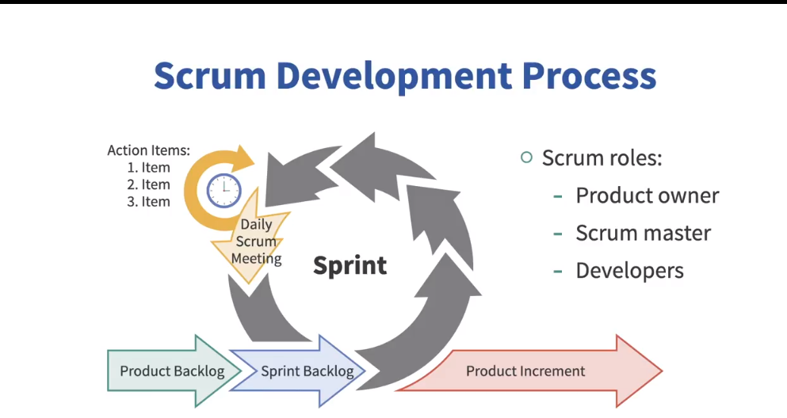
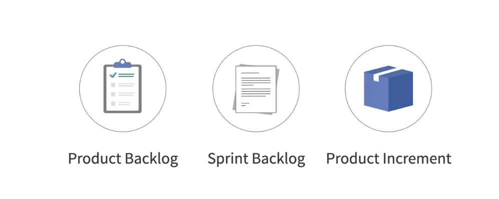
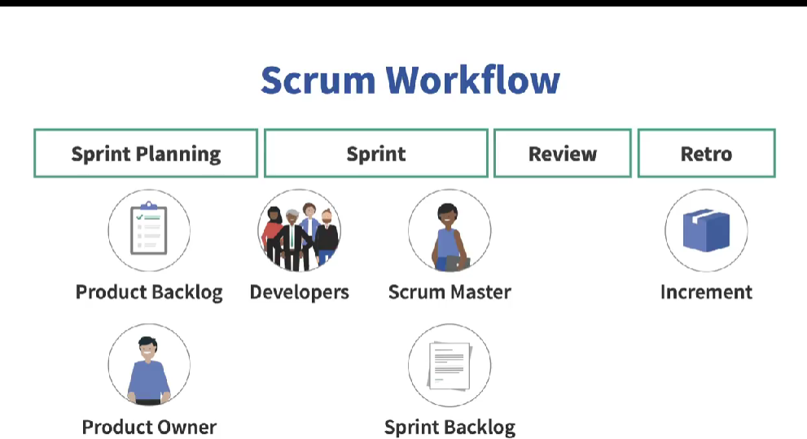

# 🌀 Scrum: A Deep Dive into the Most Popular Agile Framework

---

## 📖 What is Scrum?

**Scrum** is the most widely adopted **Agile framework** in the world today. It’s:
- **Lightweight**: Just a handful of events, accountabilities, and deliverables.
- **Deceptively simple**: Easy to understand, hard to master.
- **Extremely powerful**: Enables small teams to build big things.

> _"Scrum is an Agile framework where a small, cross-functional team works in short iterations, called sprints, to create working software."_

Scrum was **introduced in 1995** by **Ken Schwaber** and **Jeff Sutherland**. The most authoritative source of Scrum knowledge is the [**Scrum Guide**](https://scrumguides.org), which is under 20 pages and can be read in **under an hour**.

---

## 🔁 Scrum in Action — The Big Picture

At the heart of Scrum is **iteration and collaboration**.

1. A **cross-functional Scrum Team** (Product Owner, Developers, Scrum Master)
2. Pulls work from the **Product Backlog**
3. Selects a subset for a **Sprint**
4. Conducts **Daily Scrum** meetings
5. Produces a **Product Increment** at the end of the Sprint
6. Reflects, improves, and repeats

Each **Sprint** lasts **30 days or less** and ends with a **working software deliverable**.

---

## 👥 Scrum Accountabilities (Formerly “Roles”)

### 1. 🧠 Product Owner
- **Owns** the **Product Backlog** — a dynamic to-do list containing:
  - Tasks
  - Defects
  - User stories
  - Enhancements
  - Functional and Non-functional requirements
- **Final authority** on what to build and **in what priority**
- Takes input from stakeholders, but accountability lies with **one person**, not a committee.

### 2. 🧭 Scrum Master
- The **Agile Coach** of the team.
- A **servant leader** — helps remove impediments.
- **Facilitates** Scrum events if necessary.
- Ensures the team sticks to Scrum values and practices.
- Does **not manage** the Developers.

### 3. 🧑‍💻 Developers
- A **cross-functional team** that includes:
  - Programmers
  - Testers
  - DB admins
  - Tech writers
  - Sys admins
- They are **self-managing** — they know how to do their job without constant supervision.
- They plan, build, test, and deliver software **as a team**.

---

## 🧰 Scrum Artifacts

| Artifact           | Description |
|--------------------|-------------|
| **Product Backlog** | Master list of what needs to be built. Owned by the Product Owner. |
| **Sprint Backlog**  | Subset of backlog items selected for the Sprint + task breakdown. |
| **Product Increment** | The working, usable slice of software created in the current Sprint (combined with previous increments). |

---

## 🔄 Scrum Workflow: Incremental & Iterative Delivery

Let’s walk through a typical **Sprint lifecycle** step-by-step:

---

### 1. 🗓 Sprint Planning
- Marks the **start of a Sprint**.
- Developers collaborate with the Product Owner to:
  - Select backlog items for the Sprint.
  - Draft a **Sprint Goal** — a short statement that captures the **business objective** of the Sprint.
  - Build an initial plan to implement the selected items.
- Scrum Master **facilitates** if needed.
- Product Owner **clarifies questions**.

---

### 2. 📅 Daily Scrum (a.k.a. Daily Stand-up)
- A **15-minute** daily sync for Developers.
- Optional for Scrum Master and Product Owner.
- **NOT** a status meeting — it’s for the team to stay aligned and adapt.

Many teams use the **Three Question Format**:
1. What did you do since the last Daily Scrum?
2. What will you do today?
3. Any impediments?

> 📌 This format is **not mandatory** — teams can shape this event as they see fit.

---

### 3. 🧪 Development & Delivery
- Team **develops, tests, and compiles** working software.
- At the end of the Sprint, a **Product Increment** is ready.

---

### 4. 👀 Sprint Review
- Team and **stakeholders** inspect the **Product Increment**.
- **Informal** — not for final approval but for **feedback**.
- Helps inform **future Sprint planning**.
- **Time-boxed to 4 hours** for a 30-day Sprint. Adjust accordingly for shorter Sprints.

---

### 5. 🔍 Sprint Retrospective
- Team reflects on:
  - Processes
  - Collaboration
  - Tools
  - Skills
- Creates an **Action Plan** for improvement.
- **Time-boxed to 3 hours** for a 30-day Sprint.

> The Retrospective doesn’t focus on the product, but on how the **team can get better**.

---

## 💡 Two Key Takeaways about Scrum

1. ✅ Scrum is a **simple but powerful** framework to build products **incrementally**, delivering business value **faster and more frequently**.
2. 📦 Each Sprint should always end with a **potentially shippable product increment**.

---

> _“Scrum isn’t just about building software. It’s about building **better teams**, **stronger processes**, and **sustainable success**.”_

Ready to dive deeper into Scrum? Start with the [Scrum Guide](https://scrumguides.org).

