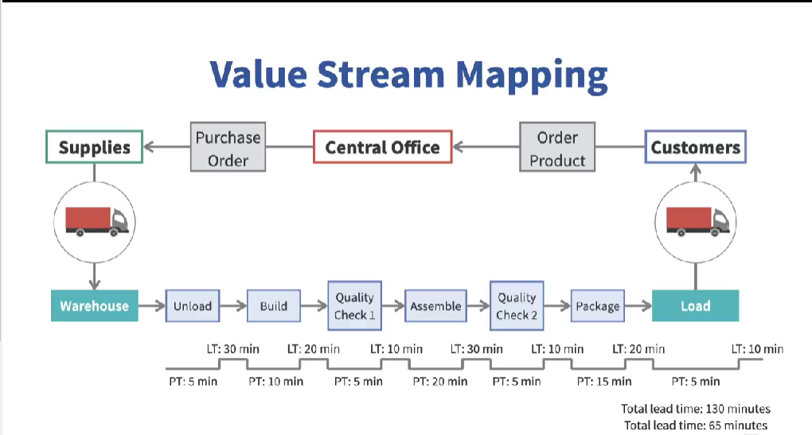
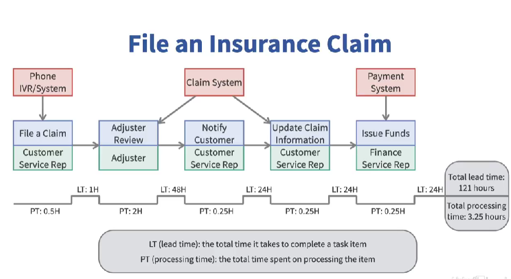

# 🚀 Lean Software Development: Overview, Mapping, and Principles

> “Build only what adds value. Discard the rest.”

Welcome to an in-depth walkthrough of **Lean Software Development** — a mindset and methodology that originates not from code, but from the shop floor of Toyota’s post-WWII production lines. This document captures the essence of Lean principles, how to map value in processes, and how software teams can use this to achieve fast, efficient, and customer-focused delivery.

---

## 📜 Historical Background: The Origins of Lean

- **Lean** has its roots in **post-World War II Japan**, a time of economic devastation and low consumer buying power.
- There was immense pressure to **rebuild manufacturing systems efficiently**.
- **Toyota Production System (TPS)** became the gold standard for manufacturing:
  - It combined **management style**, **working culture**, and **production philosophy**.
  - It focused on **reducing waste**, improving flow, and optimizing efficiency.

> Inspired by Toyota’s success, **Mary and Tom Poppendieck** published _"Lean Software Development"_ in 2003, adapting these philosophies to the software industry.

---

## 💡 What Is Lean Software Development?

Lean is not just about being fast—it's about being **efficient** and **purposeful**.

### Key Characteristics:
- Minimizes **waste**.
- Visualizes the **production pipeline**.
- Highlights **bottlenecks**, inefficiencies, and opportunities.
- Applied to **both hardware and software projects**.

---

## 🗺️ Value Stream Mapping (VSM)

### 📌 Definition:

> A **Value Stream** is a workflow—a series of steps needed to deliver a product or service with business value.

Imagine ordering a pizza. The entire sequence from order to delivery is a value stream.

### 🔍 Purpose of VSM:

- To **visualize** and **identify areas of waste**.
- To **optimize** the **value-adding** steps.
- To distinguish **value-added time** from **non-value-added time**.

---

### 🧭 Elements of a Manufacturing VSM

1. **Information Flow** (top):  
   From customer → office → supplier.

2. **Material Flow** (middle):  
   Shows actual physical steps in producing a product.

3. **Time Ladder** (bottom):  
   - **Lower staircases**: actual **processing time**.  
   - **Elevated staircases**: **total lead time** (including waiting/delays).

#### 🧮 Example:

- **Total lead time**: 130 minutes  
- **Actual processing time**: 65 minutes  
- **Wasted time**: 65 minutes

> 🎯 Goal: Identify and reduce non-value-adding steps.

---

## ⏳ Lead Time vs Cycle Time

Before diving into VSM examples, let’s clarify two essential terms:

| Term         | Definition                                                                 |
|--------------|------------------------------------------------------------------------------|
| **Lead Time**| Total time from request initiation to delivery.                             |
| **Cycle Time**| Actual time spent doing productive work on the item.                        |

🎯 _Goal_: Make **Lead Time ≈ Cycle Time** for maximum efficiency.

---

## 🧾 Business Process VSM Example: Insurance Claim

### 🏛️ Steps:
1. Customer files a claim.
2. Adjuster reviews damage and inputs data.
3. Customer service notifies customer.
4. Feedback is incorporated and claim sent to payment system.
5. Payment system issues funds.

### 🚩 Red Flags:
- **Multiple disconnected systems** = duplication of effort and syncing issues.
- **Lead Time** = 121 hours  
- **Processing Time** = 3.25 hours  
  - That’s only **3% of the time** spent doing actual work!

> 👉 Build an “as-is” VSM to spot inefficiencies. Then design a **“to-be” optimized VSM**.

---

## 🔑 Lean Principles for Software Development

Lean isn’t just a process. It’s a **mindset**.

---

### 1. 🎯 Focus on Customer Value

> "Only what adds value is worth building."

- Understand **what your customer truly values**.
- Build only those features.
- Avoid **gold plating** (adding features no one asked for).
- Use **continuous feedback** to surface implicit needs.

---

### 2. 📚 Amplify Learning

- Embrace **Agile and iterative delivery**.
- Develop and learn through **frequent feedback**.
- Adapt to **changing priorities**, **market shifts**, and **technology upgrades**.

---

### 3. 🕰️ Decide at the Last Responsible Moment

> Make important decisions only when you have enough information.

- Avoid premature planning.
- Wait until the **last responsible moment** before committing.
- Example: Only choose a database strategy once you know usage volumes.

---

### 4. ⚡ Deliver as Fast as Possible

- Fast delivery = **early value** + **early feedback**.
- Reduces:
  - Risk of misalignment.
  - Delays from shifting market conditions.
  - Large technical surprises.
- Prefer **short iterations** over long development cycles.

---

### 5. 🧠 Empower the Team

> “Agility is bottom-up intelligence.”

- Developers are **knowledge workers**, not factory labor.
- Empower them with autonomy, tools, and support.
- Encourage **creativity**, **responsibility**, and **collaboration**.

---

### 6. 🧩 Build Integrity In

There are **two types** of integrity in Lean:

| Type                 | Meaning                                                                 |
|----------------------|-------------------------------------------------------------------------|
| **Perceived Integrity** | System is easy to use, maintain, and delivers expected value.           |
| **Conceptual Integrity**| The architecture is cohesive and components work seamlessly together. |

- Techniques to build integrity:
  - **Refactoring**
  - **Thorough Testing**
  - **Consistent Customer Communication**

---

### 7. 🌐 See the Whole

> Don’t optimize parts—optimize the **entire process**.

- Understand the **full workflow** before making improvements.
- Avoid tunnel vision.
- A fast bug-identification system won’t help if your dev team lacks the skills to fix them.

---

## 📌 Summary

| Concept                | Description |
|------------------------|-------------|
| **Lean Origin**        | Post-WWII Toyota Production System |
| **Primary Goal**       | Maximize efficiency, minimize waste |
| **VSM Components**     | Information Flow, Material Flow, Time Ladder |
| **Cycle vs Lead Time** | Lead Time ≥ Cycle Time. Optimize to make them equal |
| **Core Lean Principles** | Value, Learning, Timely Decisions, Speed, Team Empowerment, Built-in Integrity, Big Picture Thinking |

---

## 📘 Final Thoughts

Lean software development is about **thoughtful efficiency**. It demands that we build what matters, when it matters, and how it brings value. Every wasted minute, every unnecessary feature, every duplicate process is a barrier between you and a satisfied customer.

> **"Stop starting. Start finishing."** — Lean proverb

---

✍️ _Crafted with clarity and purpose by ChatGPT based on a transcript by Instructor Shashi Shekhar._

