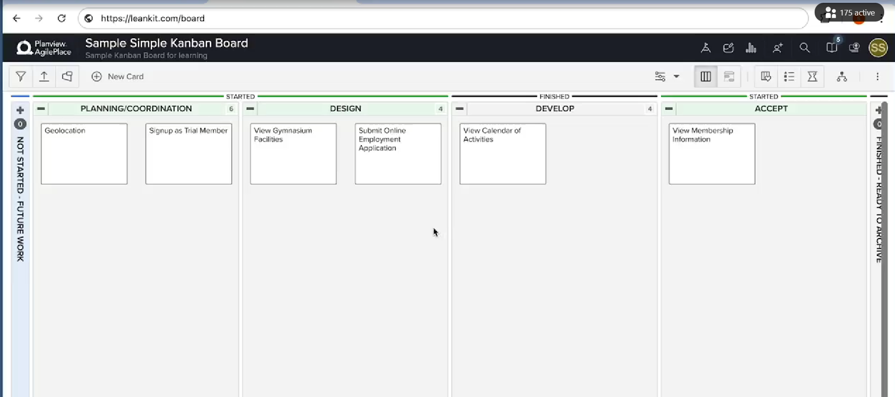
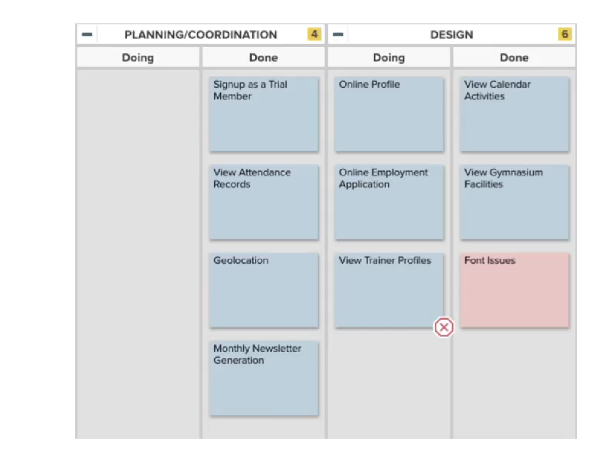

# 📌 Kanban Methodology Overview

Kanban is not just a visual tool—it's a powerful methodology for managing work based on **Lean principles**. If you're new to software process management or want to streamline your workflow, **Kanban** offers an intuitive, flexible, and efficient way to track progress and optimize productivity.

---

## 🧩 What is Kanban?

> **"Kanban is a work process management methodology based on Lean principles."**

It’s centered around two **core concepts**:

1. **Visualize your work**
   Use a **Kanban board** to show the status of each task.

2. **Limit Work in Progress (WIP)**
   Don’t overload any stage of your workflow; this maintains focus and flow.

Even though Kanban might seem simple at first, it's rooted in **advanced queuing theory**, which makes it incredibly effective.

---

## 🧪 A Real Example of a Kanban Board

To understand Kanban better, let’s look at an actual **Kanban Board** example:

* Built using **AgilePlace** (formerly known as LeanKit)
* Developed during a **free trial account** (your version may differ)
* Board has **four vertical lanes (statuses)**:

  * Planning and Coordination
  * Design
  * Develop
  * Accept

  

### 👉 How It Works:

* Each vertical **lane** represents a **status** in the workflow.
* Work items (such as **features**, **user stories**, or **defects**) move from **left to right**.
* The **rightmost lane** collects all **completed work**.

> This visual system gives a **quick snapshot** of what’s being worked on and what’s stuck.

---

## 🔄 The Concept of WIP (Work In Progress) Limits

Each lane in the Kanban board:

* Acts like a **queue**
* Has a **WIP limit** (maximum items that can be present in that queue)

### ❓Why Limit WIP?

Limiting the number of tasks helps teams:

* Work at **optimal efficiency**
* Avoid bottlenecks

### 🎓 Two Ways to Understand WIP Limits:

#### 1. Non-Arithmetic (Layman’s View):

* WIP limits depend on:

  * Number of people
  * Their skill level
  * Experience
* Too many items = overloaded team = inefficiency

#### 2. Arithmetic (Queuing Theory):

* Based on **Little’s Law** (from the 1950s):

> **C = A × B**
>
> Where:
>
> * **C** = Number of items in the work queue (WIP)
> * **A** = Average time spent per item
> * **B** = Arrival rate of new work items

Rearranged:

> **A = C / B**

So, to reduce the average time per item (**A**) and become more efficient:

* Either reduce **C** (WIP)
* Or reduce **B** (arrival rate of new tasks)

---

## 📋 A Closer Look at a Kanban Board in Action

Here’s a slightly different version of a Kanban Board with:

* Just **two statuses (queues)**:

  * Planning and Coordination
  * Design

Each queue has its own **WIP limit**.

### 🔎 Visual Indicators:

* The **Planning and Coordination** queue has hit its WIP limit (**4 items**).
* Each queue is **split into two columns**:

  * Doing
  * Done

This shows whether:

* Items are stuck **within the same queue**
* Or blocked due to **next queue** being full

In the example:

* Both queues are full
* First queue's tasks are **all done**, but second queue can’t pull more due to being full
* One task ("View Trainer Profiles") is **blocked**, shown with an ❌ icon

> The board becomes a **powerful communication tool**—it instantly shows progress and bottlenecks.

---

## 🔁 Pull System (Not Push)

Unlike Scrum, Kanban does **not** work in time-boxed iterations (like sprints).

* It’s a **pull-based system**:

  * A task is **pulled into a queue** only when there’s room.
  * There’s **no fixed timeline**—items are delivered when ready.

✅ This means:

* **Continuous delivery** of value
* No need to wait for sprint-end
* Lightweight process with minimal overhead

### 🗓️ Daily Practice:

* Besides using the board, most Kanban teams just have **daily stand-ups**

---

## 🧠 Final Thoughts

Kanban may appear visually simple, but it’s based on **deep process thinking** and **Lean principles**. It brings transparency, efficiency, and flow to your work.

> If you want a lightweight yet powerful methodology to manage your team’s workflow—**Kanban is your friend.**
