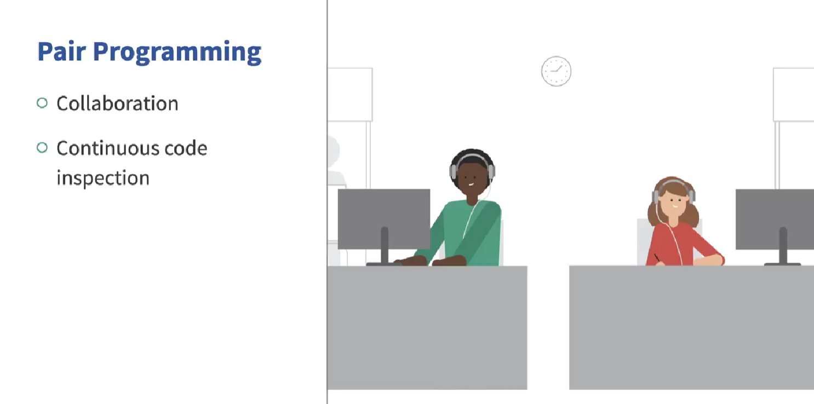

# 🚀 Extreme Programming (XP) Overview

Extreme Programming (XP) is a **fine-grained, implementation-centric** software development methodology. Designed by **Kent Beck in 1991**, XP is a collection of focused engineering practices tailored to improve software quality and responsiveness to changing customer requirements.

---

## 🌟 Core Philosophy

XP is built on:

* **Values**
* **Rules**
* **Principles**
* **Practices**

It advocates for a **customer-driven**, **iterative** process that encourages tight feedback loops and teamwork.

---

## 🔁 Iteration Structure

* **Short Weekly Iterations**: Each week is a full cycle of planning, coding, and testing.
* **Quarterly Iterations**: These are higher-level containers for weekly iterations, enabling macro-level planning.

---

## 👥 Collaboration & Task Management

* Customers are **directly involved** in providing requirements.
* Developers **self-assign tasks**, breaking down customer stories into actionable items.

---

## 🧠 Design & Development Practices

* **Just-In-Time Design**: Start with simple, high-level design and evolve it over time.
* **Continuous Refactoring**: Improve code structure continuously to handle technical debt.
* **Frequent Integration**: Developers integrate code frequently to avoid integration issues.
* **Short Build Times**: Builds are run in **10 minutes or less**.

---

## 🛠️ Core XP Practices (dozen+ total)

While there are many, two major XP practices are widely adopted even today:

---

## 👨‍💻👩‍💻 Pair Programming

* Two developers share one terminal.
* **Roles**:

  * One writes the code (**driver**)
  * The other reviews and assists (**navigator**)
* Roles are **switched periodically**.
* Benefits:

  * Constant peer review
  * Enhanced code quality
  * Real-time collaboration

---

## 🧪 Test-Driven Development (TDD)

> "Never write production code unless there is a failing test."

### 🪜 Three-Step Cycle:

1. **Write a Failing Test**

   * Write a test for a function that doesn’t yet exist.
   * It will fail or not compile—this is expected.

2. **Write Just Enough Code**

   * Add minimal code to make the test compile.
   * Test should **still fail**. If it passes, the test may be inadequate.

3. **Implement the Function**

   * Complete the code to make the test pass.
   * Then refactor.
   * Repeat for every test.

### 🔄 Cycle Continues:

* Write a test → Fail → Code → Pass → Refactor → Repeat

### 🔎 Insight:

* Hard-to-test code = often poorly designed
* TDD encourages **modular, testable** components

---

## 🧪 Testers vs. Developers

* Developers test their code thoroughly but still miss bugs due to assumptions.
* Testers are unbiased and find hidden issues.
* **TDD reduces developer bias**, helping uncover issues earlier.

---

## ⚠️ Criticism of XP

XP is sometimes criticized for:

* Being **over-simplistic**
* Not suitable for **large systems**
* Less effective with **inexperienced teams**

However, the **two XP highlights**:

* **Pair Programming**
* **Test-Driven Development**

...have proven effective across both small and large-scale systems.

---

## ✅ Summary

Extreme Programming is a powerful, iterative methodology centered around **code quality**, **teamwork**, and **customer collaboration**. While not perfect for every scenario, its core practices—**Pair Programming** and **TDD**—continue to influence modern agile development.

