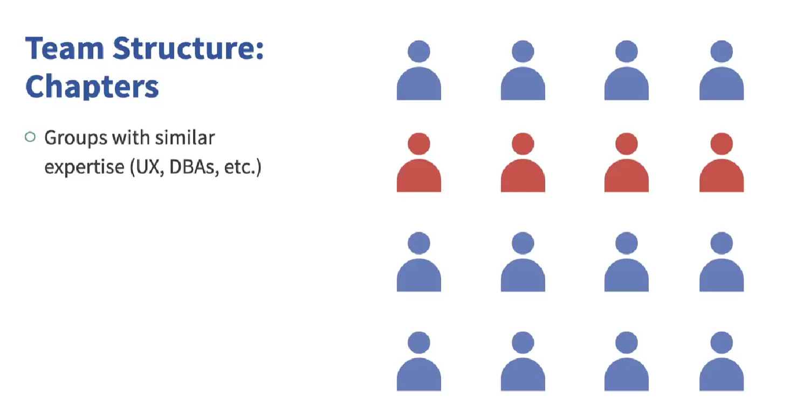
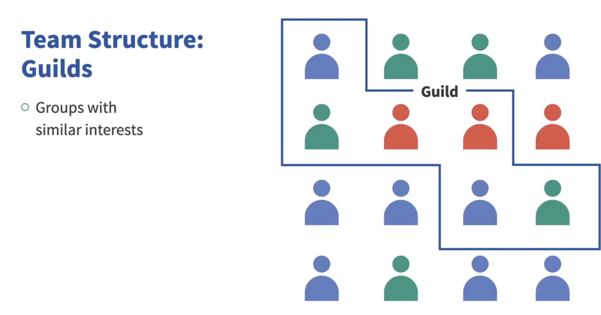

# 🎵 Spotify Engineering Model (Detailed Notes)

---

## 🔶 1. Introduction: What is the Spotify Model?

* The **Spotify Model** is not a strict Agile framework like Scrum, SAFe, or LeSS.
* It is a **case study and a culture** that emphasizes **agility, team autonomy**, and **continuous improvement**.
* Spotify does **not follow any one Agile methodology**. Instead, they use a **blend** of Scrum, Kanban, Lean, and other practices.
* Their approach is called the **Spotify Engineering Culture** — a flexible and evolving mindset.
* Core belief:

  > "Agility is more important than any specific framework."

---

## 🔶 2. Why Did Spotify Move Away from Scrum?

* Around **2008**, Spotify followed Scrum.
* As the company grew, **scaling Scrum** became difficult.
* Many Scrum practices became **counterproductive** at scale.
* Instead of adopting formal scaling methods like SAFe or LeSS, Spotify:

  * Went **back to Agile basics**.
  * Built their **own lightweight model**.

---

## 🔶 3. Team Structure in Spotify

Spotify divides its people into several **interconnected units**:

### 🔹 Squad

* Smallest unit (like a Scrum team).
* **Self-organizing**, **cross-functional**.
* Typically 1–7 people.
* Each Squad:

  * Decides **what to build and how to build it**.
  * Is **co-located** and highly collaborative.

### 🔹 Tribe

* A group of **related Squads**.
* All Squads in a Tribe work in the **same area** (e.g., playlists or search).
* Led by a **Tribe Lead**.

### 🔹 Chapter

* A group based on **shared expertise** (e.g., all frontend developers).
* Crosses across Squads but **within one Tribe**.
* Has a **Chapter Lead** who is a manager for skill development.

### 🔹 Guild

* **Interest-based** groups.
* Crosses **Squads and Tribes**.
* Formed around tech topics or hobbies (e.g., web security, design).
* Helps knowledge-sharing across company.

---

## 🔶 4. Autonomy and Freedom

* Teams are **autonomous** — they choose:

  * **How to work** (Scrum, Kanban, mix).
  * **Which tools to use**.
* Only **minimal high-level controls** from the company.
* **Lean principles** guide the culture: reduce waste, deliver fast.

---

## 🔶 5. Continuous Delivery & Release Approach

* Releases should be **routine, not drama**.
* Key practices:

### ✅ Release Train

* A metaphor for **frequent releases** (like trains).
* If a feature misses one release, it can catch the **next train**.

### ✅ Feature Toggle

* Unfinished features can be **hidden from users**.
* Reduces the need for complex **branching and merging**.
* Encourages **early integration** and fast delivery.

---

## 🔶 6. Continuous Improvement Culture

* Spotify actively works on **optimizing their work methods**.
* Uses a technique called **Kata Board** (inspired by Toyota).

### 📊 Kata Board Layout:

| Quadrant     | Description                                       |
| ------------ | ------------------------------------------------- |
| Top-Left     | Current Problem the team is facing                |
| Bottom-Left  | Ideal State (Perfect World — even if unrealistic) |
| Top-Right    | Realistic Next Target (1 step better)             |
| Bottom-Right | Next 3 Action Items to reach that target          |

---

## 🔶 7. Innovation and Learning Culture

* **Hackathons** are common to turn ideas into real features.
* Teams **learn from each other** — good practices spread organically.
* **Internal code repositories** are open:

  * Any team can see or contribute to other team’s code.

---

## 🔶 8. Agile Coaches and Support

* **Agile Coaches** act as **servant leaders**:

  * Help remove blockers.
  * Make teams more productive.
  * Encourage improvement without enforcing rigid rules.

---

## 🔶 9. Failure-Friendly Environment

* **Failures are accepted** and seen as a way to learn.
* Experiments are encouraged.
* If people fear punishment, they won’t innovate — so **failure tolerance** is key.
* Changes are designed to be **small and reversible**.

---

## 🔶 10. Collaboration Over Bureaucracy

* Teams are **self-service** oriented:

  * Solve their own problems instead of waiting for others.
* Hand-offs between teams are **minimized**.
* Bureaucracy is **reduced** at all levels.
* **Chaos is better than bureaucracy** — flexibility matters more.

---

## 🔶 11. Summary: Why the Spotify Model Works

* **People-first** culture.
* Blends useful parts of Agile, not tied to any one framework.
* Lightweight, flexible, and **adaptable**.
* Spotify humbly acknowledges:

  > “This may not work for your company — adapt it as needed.”

---

## 📄 Want to Learn More?

* Check out Spotify’s official blog and case study on Spotify Engineering Culture.
