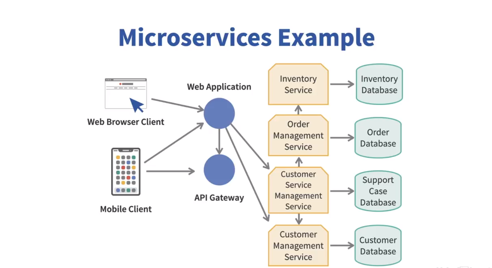
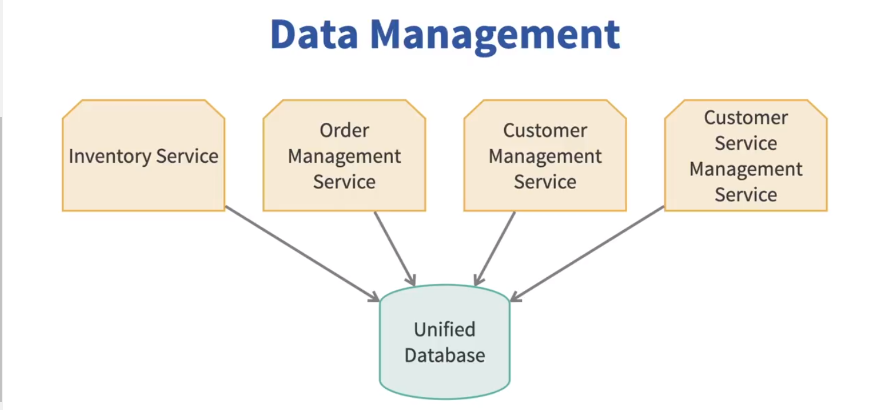

# 🚀 Microservices: Key Concepts & Deployment Scenarios

---

## 🔶 1. Why Microservices Matter

* Microservices represent an **architectural and implementation pattern**.
* Goal: Improve **time-to-market** and the **efficiency** of the software lifecycle.

> They're not just a tech trend — they address real problems in legacy deployment.

---

## 🔶 2. Evolution of Deployment Architectures

### 🔹 Mainframe Era

* Large executables on powerful centralized servers.
* Users interacted via **dumb terminals**.
* Hard to maintain; monolithic and imperative.

### 🔹 Thick Clients (2-Tier)

* Applications ran on user machines.
* Backend was a single shared database.

### 🔹 N-Tier Applications

* Layers: Presentation → Business Logic → Data Access → Database.
* Better separation of concerns.
* Still deployed as a **single unit** (monolith).
* Problems:

  * Memory leaks crash the whole app.
  * Schema changes break everything.
  * Deployment is inflexible.

---

## 🔶 3. What Are Microservices?

* **Microservices** = Architecture where apps are built as a set of **independent services**, each focused on **one business domain**.

### 📅 Example: Retail Store

Services could include:

* Inventory Service
* Customer Management Service
* Order Management Service
* Customer Support Service

### 🔹 Characteristics:

* Each service has its **own codebase**, **own database**, and is **independently deployable**.
* Services communicate via **well-defined interfaces (APIs)**.
* Built around **business capabilities**, not technical layers.
* Teams can work in **parallel** on different services.
* Services can be built with **different languages/tech stacks**.
* Each service can be **scaled or upgraded independently**.

### ⚠ Disadvantages:

* Complex **inter-service communication**.
* **Integration testing** is harder.
* **Data duplication** and **distributed transaction management** challenges.

---

## 🔶 4. Deployment Scenarios

### 🔹 Single Database for Multiple Services

* **Pros:** No data duplication.
* **Cons:**

  * Services become **tightly coupled**.
  * A change in the schema can **break multiple services**.
  * Services may need different kinds of databases (SQL vs NoSQL).

### 🔹 One Database per Service

* Recommended approach.
* **Challenge:** Data sync across services.

### ✅ Solutions for Syncing Data:

1. **Replication** between databases.
2. **Event-driven communication:**

   * One service publishes an **event**.
   * Others **subscribe** and update their data accordingly.

---

## 🔶 5. Handling Dependencies and Communication

### 🔹 Synchronous Communication

* Real-time interaction between services.
* **Issue:** A failure in one can affect others.

### 🔹 Asynchronous Communication

* Use **message queues** or **event brokers**.
* Reduces coupling and improves reliability.

### 🔹 Compensating Transactions

* For operations involving multiple services.
* If one step fails, use **compensating actions** to undo changes.

---

## 🔶 6. Gateway & Load Management

### 🔹 API Gateways

* All service interactions go through **lightweight APIs**.
* Helps manage routing, authentication, and rate limiting.

### 🔹 Load Balancers

* Distribute traffic across multiple instances.
* Improve scalability and resilience.

### 🔹 Auto-scaling

* Services scale independently based on:

  * CPU usage
  * Memory
  * Network traffic

---

## 🔶 7. Containers & Microservices

### 🔹 What are Containers?

* **Package** application and its dependencies.
* Run on **container engines** like Docker.
* Enable **isolation** and **consistent environments**.

### 🔹 Note:

> Running a monolith inside a container **does not make it a microservice**.

* Microservices architecture is about **independent, focused services**, not just packaging.

---

## 🔶 8. When Not to Use Microservices

* **Small apps** with limited functionality and change.
* Apps that don't require frequent deployments or scaling.

> Microservices add complexity — don’t use them unless the **benefits outweigh the cost**.

---

## 📄 Summary

* Microservices = Independent services for each **business domain**.
* Allow **independent scaling, deployment, and development**.
* Ideal for large, evolving, and distributed systems.
* Not suitable for every project — assess your needs first.

> The key principle: **Each service should be independently deployable**.
