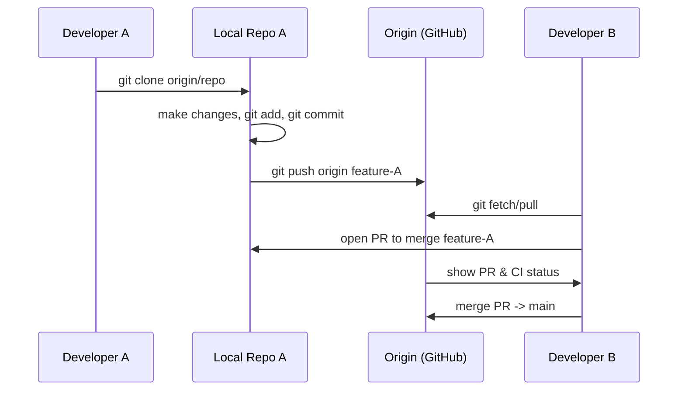

# 🧭 Understanding Version Control

Version control, also called **source control**, lets you **track and manage changes** to code over time. This enables you to:

* Look at the **history** of your project.
* Restore any part of the project to any **previous state**.
* Collaborate effectively with a team.

With version control:

* Developers can work together on the same project.
* You can share your code for **review** or **comments**.
* The system tracks **who** made **what changes** and **when**.

---

## 🏛 Types of Professional Version Control

There are two main architectures:

### 1. Centralized Version Control

* All files and history are stored in a **central server**.
* Changes are tracked **on the server**.
* Developers check out files from that central location.
* Example: **Apache Subversion (SVN)**.

**Pros:** Simple to understand.

**Cons:** If the server is down, no one can commit or retrieve updates.

---

### 2. Distributed Version Control

* Developers keep a **full copy** of the project (including history) on their local machines.
* This copy is called the **working copy**.
* Developers can make commits locally, then **push** changes to a main repository.
* They can also **pull** updates made by others.

**Pros:**

* Work offline easily.
* No single point of failure — every clone has the full history.

**Example:** **Git**.

---

## 🔄 Common Workflow in Distributed Systems (Git)

1. **Clone** a project to get your own local copy.
2. Make changes in your **working copy**.
3. **Commit** those changes locally.
4. **Push** changes to the main repository.
5. **Pull** changes from the main repository to update your local copy.

---

## 📌 Key Terms

* **Clone**: Create a local copy of the repository.
* **Working copy**: The version of the code you edit.
* **Commit**: Save a snapshot of your changes.
* **Push**: Send your commits to a remote repository.
* **Pull**: Retrieve commits from a remote repository.

---

**Extra Tip:** In Git, every commit is like a checkpoint in your project’s history. You can branch off at any checkpoint to create a new path of development, then merge it back if needed.


--------------------------------

# 🧭 Understanding Version Control

> **Instructor:** “There are different types of version control systems you can use besides Git. Let’s talk about what they are, and specifically what we call distributed version control.”

This document converts the transcript into a **developer-focused, deep-dive** Markdown study note. It’s written for someone who wants to go from the fundamentals of version control to a solid, practical understanding useful for real-world software projects.

---

## 🔍 What is Version Control?

**Version control** (also called *source control*) lets you **track and manage changes to files over time**. For codebases this gives you:

* A historical timeline of changes (who changed what and when).
* The ability to **restore** any earlier state of the project.
* Mechanisms for **collaboration** (multiple contributors working simultaneously).
* Tools for reviewing changes (diffs, code review, comments).

Together, these features make development safer, auditable, and reversible — so teams can experiment without taking on irreversible risk.

---

## 🏛 Two Main Architectures

There are two common professional architectures for version control:

1. **Centralized Version Control**
2. **Distributed Version Control**

They differ mainly in **where** the project history is stored and how collaborators interact with it.

### Centralized Version Control (e.g., SVN)

* All files and their full history are kept on a **central server**.
* Developers **check out** files from the server and commit back to it.
* The server is the single source of truth.

**Pros:**

* Simple mental model.
* Fine-grained server-side access control.

**Cons:**

* Single point of failure (if server is down or corrupted, development grinds to a halt).
* Offline work is limited or impossible.
* Merging and branching are often heavier and less integrated.

**Example systems:** Apache Subversion (SVN), Perforce (centralized modes).

### Distributed Version Control (e.g., Git)

* Every developer **clones** a full copy of the repository, including history, onto their machine.
* That clone is called the **working copy** (or local repository).
* Developers make **local commits** freely and then **push** their changes to a shared remote repository when ready.
* Developers also **pull** or **fetch** changes from remotes to synchronize.

**Pros:**

* Robust offline workflows — you can commit, branch, diff locally without network.
* No single point of failure — every clone contains the full history.
* Powerful branching and merging workflows.

**Cons:**

* Initial concept has slightly more moving parts to learn (local vs remote, pushing/pulling).
* Requires some discipline for collaboration (protecting main branches, using PRs).

**Example systems:** Git, Mercurial (Hg), Bazaar.

---

## 🔁 Common Distributed VCS Workflow (Git-centric)

1. **Clone** the repository to create a local copy:

```bash
# clone a specific branch into a folder named 'project'
git clone -b 01_02b https://example.com/user/repo.git project
```

2. Make changes in your **working copy**.
3. Stage changes to the **index** (staging area):

```bash
git add file1.js
# or add all changes
git add -A
```

4. **Commit** locally (creates a new commit object in your local `.git`):

```bash
git commit -m "Implement feature X"
```

5. **Push** to a remote when ready to share:

```bash
git push origin feature-branch
```

6. **Pull** changes from upstream to incorporate teammates’ work:

```bash
git pull origin main
# Or fetch + merge separately:
git fetch origin
git merge origin/main
```

> Note: `git pull` is shorthand for `git fetch` + `git merge` by default (or `--rebase` if configured).

---

## 🧠 Key Git Concepts (what’s happening under the hood)

* **Working directory**: your current checked-out files.
* **Staging area (index)**: a snapshot area you prepare before committing.
* **Local repository**: the `.git` directory containing all objects and refs.
* **Remote repository**: shared repo (e.g., on GitHub) that others can fetch/push to.
* **Commit object**: contains a tree (snapshot of files), parent commit(s), author/committer metadata, timestamp, and a message.
* **Branch**: a movable pointer (ref) to a commit (e.g., `main`, `feature/login`).
* **HEAD**: a reference to the current branch or commit you have checked out.
* **SHA-1/SHA-256**: identifiers for objects. Git historically used SHA-1; newer versions support SHA-256.

**Annotated vs lightweight tags:**

* Annotated tags are full objects with signer, message, date.
* Lightweight tags are just pointers to commits.

---

## 🔧 Useful Commands (quick reference)

* `git status` — show staged/unstaged changes
* `git diff` — show changes
* `git add <file>` — stage file
* `git commit -m "msg"` — commit staged changes
* `git log --oneline --graph --decorate --all` — readable commit graph
* `git branch` — list branches
* `git checkout <branch>` or `git switch <branch>` — change branch
* `git checkout -b <branch>` or `git switch -c <branch>` — create & switch
* `git fetch` — update remote refs locally
* `git pull` — fetch + merge (or rebase)
* `git push origin <branch>` — push branch to remote
* `git merge <branch>` — merge another branch into current
* `git rebase <branch>` — replay commits onto another base
* `git reflog` — see local reference history (undo safety net)
* `git restore <file>` — revert working tree file (newer command)

---

## 🔄 Collaboration Patterns & Workflows

### 1. Centralized workflow

* Everyone clones a central repo and works directly on shared branches (e.g., `main`).
* Simpler but riskier for large teams.

### 2. Feature branch workflow

* Each new feature or fix lives in its **own branch**.
* Work locally, push feature branch, open a Pull Request (PR) for review.
* Merge into `main` once reviewed and CI passes.

### 3. Fork and Pull Request workflow (common on GitHub)

* Contributors **fork** the main repo (their personal copy on GitHub).
* Work in a branch on the fork and create a PR against the upstream repo.
* Maintainers review, discuss, and merge.

### 4. Trunk-based development + short-lived feature branches

* Keep `main` (or `trunk`) always releasable.
* Feature work is integrated frequently to avoid long-lived branches and hard merges.

Each pattern has trade-offs around review latency, CI complexity, and release guarantees.

---

## ⚠️ Merge Conflicts & How to Resolve

Conflicts occur when the same lines or nearby sections are changed differently on two branches.

Typical resolve flow:

1. `git fetch origin`
2. `git merge origin/main` (while on your feature branch) — conflict occurs
3. Edit files to resolve conflict markers (`<<<<<<<`, `=======`, `>>>>>>>`)
4. `git add <resolved-files>`
5. `git commit` (or `git merge --continue`)

Tools to help:

* `git mergetool` integrations (kdiff3, meld, VS Code merge editor)
* Unit tests & CI to catch regression after merge

Pro tip: rebase frequently or integrate from `main` often to reduce large conflicts.

---

## 🔁 Rewriting History (be careful!)

* `git commit --amend` — change the last commit (local only until pushed)
* `git rebase -i` — interactively edit, squash, reorder commits

**Rule of thumb:**

* **Never rewrite public history** that others have based work upon (don’t `push --force` to shared branches without coordination). When you must force-push, prefer `git push --force-with-lease` to avoid clobbering others.

---

## 🧩 Advanced Topics (next-level understanding)

* **Garbage collection & object store**: Git stores objects under `.git/objects`. `git gc` compresses objects and cleans up.
* **GPG-signed commits & tags**: cryptographically verify authorship.
* **Hooks**: scripts run at lifecycle events (`pre-commit`, `pre-push`, `post-merge`) to enforce checks.
* **Submodules & Subtrees**: include other repositories inside a repo — useful but adds complexity.
* **LFS (Large File Storage)**: handle big binaries (images, models) outside normal Git objects.
* **Partial clones & sparse-checkout**: work with large monorepos by checking out only parts of the tree.

---

## 🗂 Backups and the Role of Remotes

A remote repository (e.g., GitHub) often acts as the team’s canonical copy and **a form of backup**. However:

* Treat remotes as **collaboration endpoints** rather than complete backup guarantees.
* For critical data, use dedicated backup and archival policies (snapshots, storage replication).
* Private forks, tags, and release artifacts help preserve important states.

---

## ✅ Best Practices & Tips

* Commit small, logical units with clear messages.

  * Use semantic commit messages: `feat:`, `fix:`, `docs:` etc. (Conventional Commits).
* Use PRs for code review and CI validation.
* Protect important branches (require reviews, required CI checks).
* Keep branches short-lived and integrate often.
* Use `git log --oneline --graph --decorate --all` to quickly visualize history.
* Rely on `git reflog` when you think you lost commits — it’s your recovery safety net.

---

## 🌱 Example: Visualizing a Simple Distributed Flow (Mermaid)



---

## 🧾 Quick Revision Checklist

* What is the staging area? — The index where you prepare snapshots before committing.
* How does distributed VCS differ? — Everyone has the full history locally.
* Commands to remember: `clone`, `add`, `commit`, `push`, `fetch`, `pull`, `merge`, `rebase`.
* Safety tools: `reflog`, `gc`, `hooks`, `verify (signed commits)`.

---

## 📚 Further reading & practice tasks (suggested)

* Practice: Clone a repo, create a feature branch, make multiple commits, push, open a PR, address comments, and merge.
* Try: `git log --oneline --graph --decorate --all` and `git reflog` after creating and squashing commits.
* Explore: Configure a `pre-commit` hook to run linters automatically.

---

> If you want, I can convert this into a printable study sheet, or into a deeper technical appendix that describes internals (object format, packfiles, and reference implementation notes). Just tell me which level of internals you want next.
