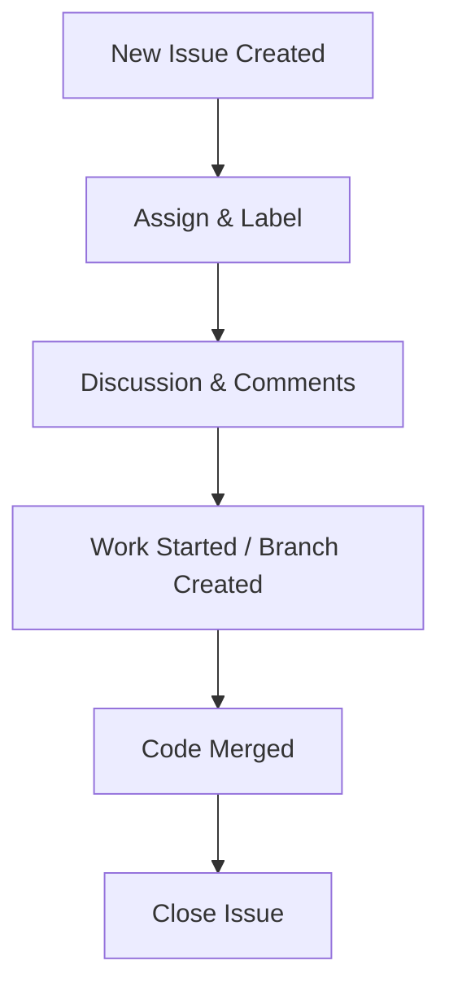

# GitHub Issues — Guide

GitHub Issues provide a collaborative way to track bugs, feature requests, and discussions.

---

## Creating an Issue

1. Navigate to the **Issues** tab in your repository.
2. Click **New issue**.
3. Add a **Title** (e.g., `Potential New Features`).
4. Add a **Description** — can include:

   * Markdown formatting
   * Headings (`#` syntax)
   * Slash commands (alerts, notes, checkboxes, tables)
   * Mentions (`@username`)
5. **Assign** the issue to team members (notifies them automatically).
6. Add **Labels** (categorization and filtering).

   * Example: `enhancement`, `help wanted`, `good first issue`
7. Optionally link to:

   * **Projects**
   * **Milestones** (deadlines, grouped tasks)
8. Attach files (paste, drag/drop, or upload).
9. Click **Create**.

---

## Common Labels

| Label            | Purpose                        |
| ---------------- | ------------------------------ |
| enhancement      | New feature or improvement     |
| bug              | Fix needed                     |
| documentation    | Docs-related issue             |
| help wanted      | Invite community contributions |
| good first issue | Beginner-friendly task         |

---

## Working with Issues

* **Comment**: Add discussion, code snippets, or resources.
* **Close**: Marks as resolved.
* **Reopen**: Continue discussion or readdress problem.
* **Transfer**: Move issue to another repository.
* **Create branch** from issue: Links code changes directly to the issue.
* **GitHub Workspace with AI (Copilot)**: Attempt to automate resolution (subscription may be required).

---

## Managing Issues

### Filtering

* By default: `is:issue state:open`.
* Filter by label, milestone, assignee, or creator.
* Example: Show issues authored by `jojo`.

### Sorting

* Sort by: newest, oldest, most commented, least commented, etc.

### Labels & Milestones

* Edit labels from **Labels** tab.
* View/create milestones from **Milestones** tab.
* Milestones group issues under a shared goal/date.

---

## Example Workflow

---

**Key Tip:** Keep issue titles clear, use labels effectively, and close issues promptly to maintain a healthy project workflow.
